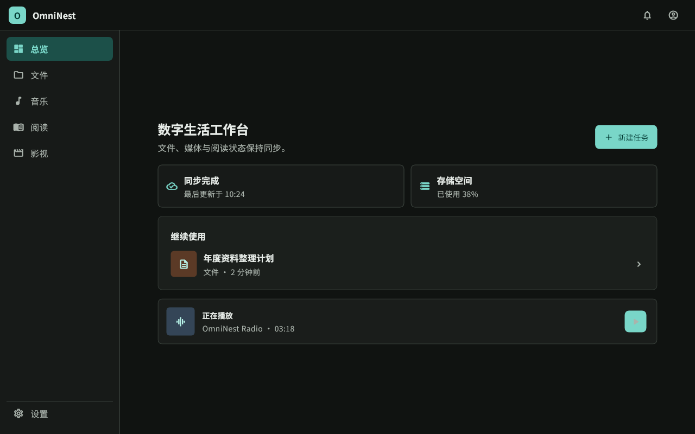
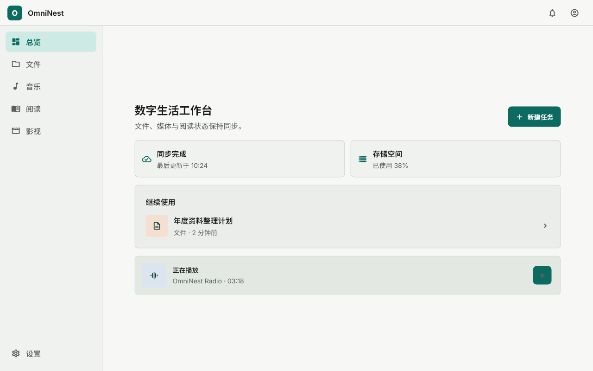
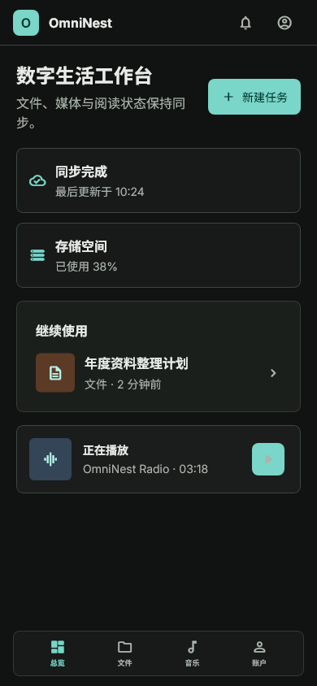
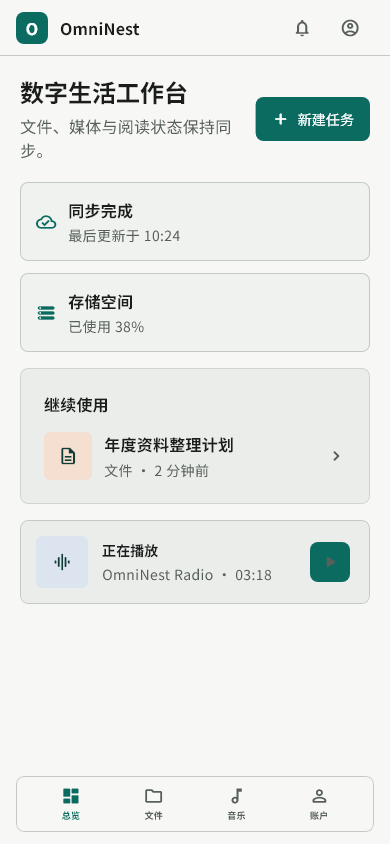

# OmniNest

OmniNest 是一个面向个人和家庭场景的自托管数字生活中心。它将文件管理、影视、音乐、相册和阅读组织在统一的账户、权限、存储和后台任务体系中，支持 Web、Android、Windows 和 macOS。

项目仍在持续开发中。本文件说明产品定位、核心能力、整体结构和最短启动路径；后端实现与 API 见 [backend/README.md](backend/README.md)，Flutter 客户端实现与构建方式见 [frontend/README.md](frontend/README.md)。

## 核心功能

| 模块 | 主要能力 |
| --- | --- |
| Portal | 统一工作台、动态背景、最近内容、通知和跨模块入口 |
| File Manager | 文件上传、目录管理、搜索、预览、下载、回收站及存储生命周期管理 |
| Photos | 图片导入、相册浏览、缩略图、元数据、位置和图像分析结果查看 |
| Movies | 影视库、海报与详情、视频播放、字幕、播放进度和本地媒体来源 |
| Music | 本地音乐库、外部音乐平台、播放队列、歌词/封面和播放进度 |
| Reader | EPUB 等书籍导入、目录、文本阅读、漫画页面阅读、书签、批注和阅读进度 |
| Admin | 用户、角色权限、系统配置、后台任务、操作审计、通知和运行状态管理 |
| Profile | 个人资料、主题切换、账号安全和个人偏好 |

## 核心业务链路

1. 首次部署后打开安装向导，创建实例首个超级管理员并完成基础初始化。
2. 登录后由 Portal 提供最近内容、任务状态、通知和业务模块入口。
3. File Manager 负责文件内容、目录、权限、版本、回收站和存储生命周期；Photos、Movies、Music、Reader 通过统一文件能力读取内容并保存各自的业务元数据。
4. 导入、解析、缩略图、索引、媒体探测和安全扫描等需要持续运行的流程进入后台任务，页面可以查询进度和失败原因。
5. 个人中心统一提供浅色、深色和跟随系统主题等偏好，并在不同窗口尺寸下保持一致的信息架构。

## 技术栈

| 层次 | 技术与职责 |
| --- | --- |
| 客户端 | Flutter、Dart，统一实现 Web、Android、Windows 和 macOS |
| 后端 | Java 21、Spring Boot 4.0.x，模块化单体并支持 API、Worker、Scheduler 运行角色 |
| 业务数据 | PostgreSQL，保存用户、权限、配置、任务、通知、媒体元数据和派生状态 |
| 内容存储 | MinIO 作为默认托管存储；File 模块通过受控 Storage Provider 统一读取和写入 |
| 本地媒体 | 管理员登记的 `LOCAL_FILESYSTEM` 只读影视来源，使用部署白名单和路径边界校验 |
| 异步基础设施 | RabbitMQ 处理可追踪、可重试、可恢复或需要调度的后台任务 |
| 缓存与并发 | Redis 提供缓存、短期状态、限流和并发控制 |
| 搜索与识别 | Lucene 默认负责嵌入式搜索，Apache Tika 负责内容识别和文本提取；Photos 图像分析可选使用 Sidecar |

## 项目结构

| 目录 | 内容 | 入口文档 |
| --- | --- | --- |
| [backend](backend/README.md) | Spring Boot API、Worker、Scheduler 和后端测试 | [后端开发指南](backend/README.md) |
| [frontend](frontend/README.md) | Flutter Web、Android、Windows、macOS 客户端与测试 | [前端开发指南](frontend/README.md) |
| [ai-sidecar](ai-sidecar/README.md) | Photos 图像分析侧车、模型适配和容器定义 | Sidecar README |
| [deploy](deploy/README.md) | dev/prod Docker 编排、镜像构建和运行配置 | 部署 README |

## 环境要求

- Git 和 Git Bash。
- Docker Desktop 与 Docker Compose v2，用于 PostgreSQL、Redis、RabbitMQ、MinIO 及可选辅助服务。
- JDK 21 和 Maven，用于运行后端。
- Flutter stable。当前项目验证基线为 Flutter 3.44.8、Dart 3.12.2。
- Chrome，用于 Web 开发；Android Studio 与 Android SDK 用于 Android 开发；Windows 或 macOS 对应桌面工具链用于桌面构建。

## 快速开始

以下命令均从项目根目录执行。后端和前端需要使用两个 Git Bash 终端。

### 1. 获取代码

```bash
git clone git@github.com:AtaraxyEcho/omni-nest.git
cd omni-nest
```

### 2. 启动开发依赖

```bash
cp deploy/dev/.env.example deploy/dev/.env
docker compose --env-file deploy/dev/.env -f deploy/dev/docker-compose.yml up -d
```

开发编排主要启动基础设施和可选辅助服务，后端与 Flutter 客户端仍以本地进程运行。Compose 的 `.env` 不会自动注入后端进程。

### 3. 启动后端

在第二个终端执行：

```bash
cd omni-nest
cp backend/.env.example backend/.env
cd backend
mvn -pl omninest-app spring-boot:run -Dspring-boot.run.profiles=dev
```

后端默认 API 地址为 `http://localhost:8080/api/v1`，OpenAPI 文档地址为 `http://localhost:8080/api-docs`，Swagger UI 地址为 `http://localhost:8080/swagger-ui.html`。

### 4. 启动 Flutter Web

在第一个终端或新的终端执行：

```bash
cd omni-nest/frontend
test -f env/dev.json || cp env/dev.example.json env/dev.json
flutter pub get
flutter run -d chrome --web-port=3000 --dart-define-from-file=env/dev.json
```

浏览器打开 `http://localhost:3000`。首次安装使用 `http://localhost:3000/setup`，完成后进入登录页和 Portal。

`frontend/env/dev.json` 是本地编译期配置，不会被 Flutter 自动读取；启动或构建时必须通过 `--dart-define-from-file` 或单独的 `--dart-define` 传入。Android、Windows 和 macOS 使用同一配置时，必须把 API 和 WebSocket 地址改成客户端可以访问的后端地址。

### 5. 其他平台

前端设备查询、Android、Windows、macOS 的启动与构建命令见 [frontend/README.md](frontend/README.md)。生产环境的容器编排和 HTTPS 入口见 [deploy/prod/README.md](deploy/prod/README.md)。

## 界面预览

下列图片来自前端 Workbench 的可重复 UI 测试基线，展示桌面端和移动端在浅色、深色主题下的实际布局，用于说明当前系统的视觉方向和跨平台信息架构。

<table>
  <tr>
    <th>桌面端 · 深色</th>
    <th>桌面端 · 浅色</th>
  </tr>
  <tr>
    <td></td>
    <td></td>
  </tr>
  <tr>
    <th>移动端 · 深色</th>
    <th>移动端 · 浅色</th>
  </tr>
  <tr>
    <td></td>
    <td></td>
  </tr>
</table>

## 相关文档

- [后端 README](backend/README.md)：服务职责、模块、API、存储、环境变量、启动和测试。
- [前端 README](frontend/README.md)：页面结构、后端交互、环境配置、启动、构建和 Flutter 开发规范。
- [开发环境部署](deploy/dev/README.md)：本地基础设施编排。
- [生产环境部署](deploy/prod/README.md)：生产容器、Nginx、可选 HTTPS 和证书配置。

## 项目状态

项目处于持续开发阶段。生产部署前应按实际环境检查公开地址、CORS、JWT 密钥、数据库与消息服务凭据、MinIO 私有存储、日志和 HTTPS 配置；不要将真实密码、Token、密钥或生产配置提交到仓库。
